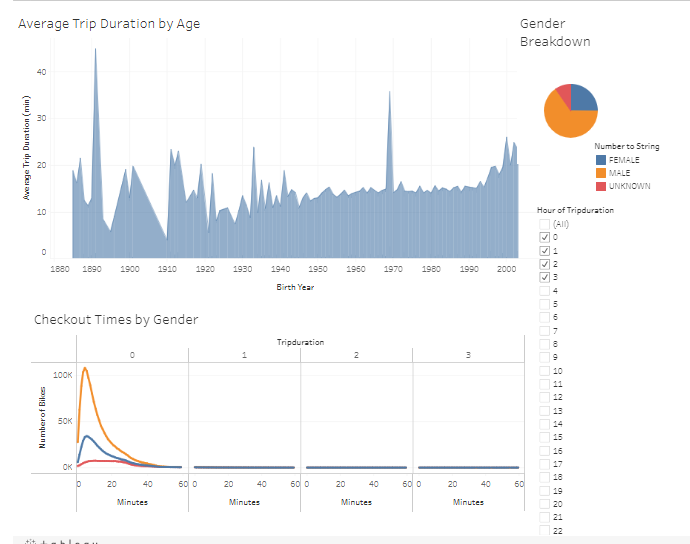

# bikesharing

## Overview
For this project, data from the Citi Bike program in New York City was used and analyzed to see if a bike share program will be feasible in Des Moines, Iowa. Knowing fully well that Des Moines is not the same as NYC (large population differences and  difference in accessibility), careful thought and analysis was preformed to only ensure that useful data should be used to make inferences about the potential success of a bike share program in Des Moines. Visualizations were created and put in Tableau dashboards and stories to build an argument to investors as to why they should invest in a bikeshare program in Des Moines.   

## Results

The full story on Tableau public can be found here: [link to story](https://public.tableau.com/shared/NF2TX67K3?:display_count=n&:origin=viz_share_link)

Three visualizations are on the dashboard below. The following observations can be made: 
1. Younger users take the bikes out for a longer duration. 
2. Users typically use the bikes for around the same time duration. 
3. The dataset was comprised of around 25% female, 60% male, and 15% unknown. 

From the following visualization, users took took each bike out for roughly 5 to 6 minutes. 

From the following visualization, it can be seen that the most popular times were Mondays, Tuesdays, and Thursdays between 5 and 7 pm. Other higher usage times were Mondays through Fridays around 8 am and Saturday mornings between 10 am and noon. 

From this visualization, it can be see that both male and female genders exhbitied the same usage behavior. 

From this visualization, males subscribers used the bikes the most and most consistently throughout the week. For customers, they appear to use the bikes more on the weekends than throughout the week, but not by much. Usage appears to be not correlated with day of the week. 

## Summary

Since NY has more tourism than Des Moines, more visualizations should be created to see how the behavior of subscribers versus customer choose to use the bikeshare. It is recommended to visualize the checkout times by the user type as well as average trip duration by user type. If it looks like the bikes in NYC are mostly used by tourists (they would most likely be customers, rather than subscribers), then this business model may not fit for Des Moines. If it is a mostly subscriber based market, then it might be a more feasible business plan for Des Moines. 